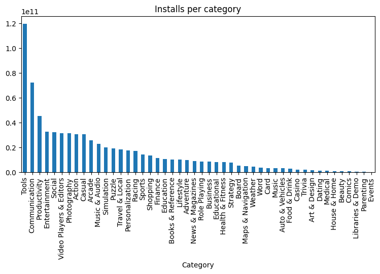
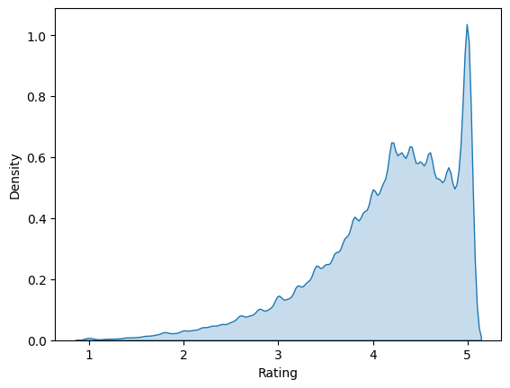
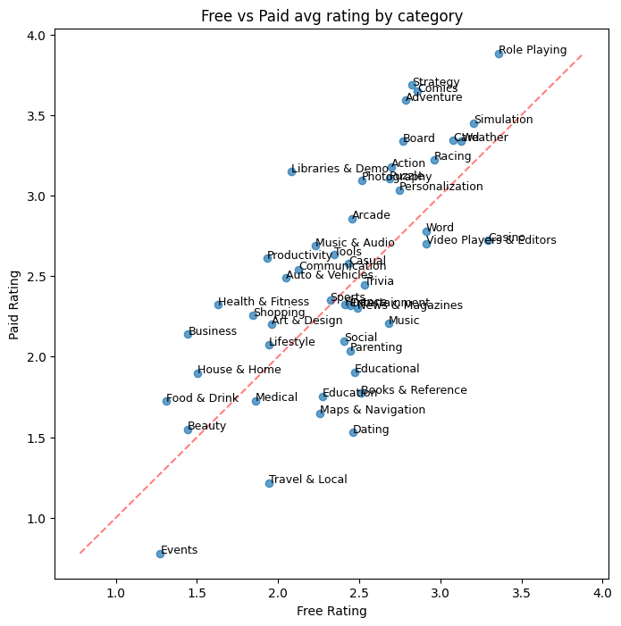
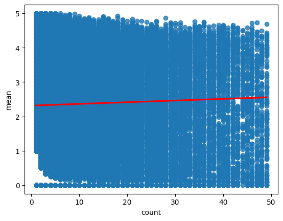
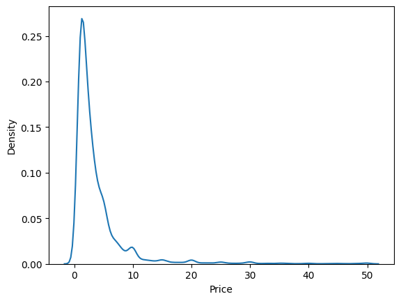
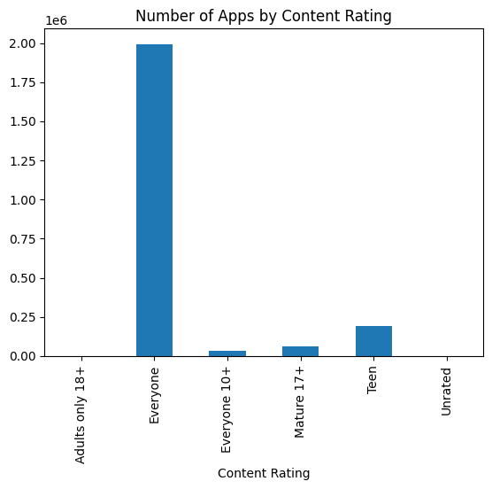

# 📱 Google Play Store — EDA & SQL Business Challenge

> **IronHack Data Science & Machine Learning Bootcamp** · Business Challenge Project · March 2026

---

## 🎯 Project Overview

This is a bootcamp business challenge from IronHack's Data Science & ML programme. The task: take the Google Play Store dataset, explore it visually with Python, load it into a SQLite database, and then answer **10 business questions using SQL only**.

The goal is to practice the full analyst workflow — from raw data to visual EDA to structured SQL querying — and present findings in a professional format.

**Deliverables:**
- `eda.ipynb` — exploratory data analysis in Python (pandas, matplotlib, seaborn)
- `solution.sql` — SQL queries for all 10 business questions
- `Google_PlayStore_SQL_Presentation.pptx` — slide deck with queries, results and insights
- `Google_PlayStore_Report.pdf` — full written report combining EDA and SQL findings

---

## 📦 Dataset

**Source:** [Google Play Store Apps — Kaggle](https://www.kaggle.com/datasets/gauthamp10/google-playstore-apps)

| Property | Value |
|---|---|
| Rows | 2,312,944 |
| Columns | 24 |
| Missing values | None |

The dataset captures a comprehensive snapshot of every app on the Play Store at scrape time — ratings, install counts, pricing, developer info, content rating, and more. Because it is already clean (no nulls, no broken types after a small preprocessing step), it is ideal for direct SQL analysis.

<details>
<summary>📋 All 24 columns</summary>

| Column | Description |
|---|---|
| App Name | Display name |
| App Id | Unique package identifier (e.g. `com.example.app`) |
| Category | Store category |
| Rating | Average user rating (1.0–5.0) |
| Rating Count | Total ratings submitted |
| Installs | Install range string (e.g. `1,000,000+`) |
| Minimum Installs | Lower bound of install count (numeric) |
| Maximum Installs | Actual install count (numeric) |
| Free | Boolean — free to download |
| Price | Purchase price (0.0 for free apps) |
| Currency | Price currency code |
| Size | APK size |
| Minimum Android | Minimum required Android version |
| Developer Id | Developer's store identifier |
| Developer Website | Developer's public website URL |
| Developer Email | Developer's contact email |
| Released | Original release date |
| Privacy Policy | Privacy policy URL |
| Last Updated | Date of most recent update |
| Content Rating | Age group (Everyone / Teen / Mature 17+) |
| Ad Supported | Boolean — app contains advertising |
| In App Purchases | Boolean — offers in-app purchases |
| Editor's Choice | Boolean — Google Editor's Choice |
| Scraped Time | Timestamp when the record was scraped |

</details>

---

## 🔍 Exploratory Data Analysis

EDA was done in `eda.ipynb` before formulating the business questions. Key areas explored:

### Install Distribution
The install distribution is extremely skewed. **Tools dominates with 119+ billion installs** — roughly 65% more than second-place Communication. Beyond the top 5, the market forms a classic long tail.



---

### The 5-Star Rating Illusion
The overall rating KDE has a suspicious spike at 5.0. Filtering to apps with **fewer than 100 reviews** makes it obvious: apps with just one or two 5-star ratings pull the average to a perfect 5.0. This is noise, not signal — and it directly motivated Q8.



---

### Free vs Paid: Does Price Buy Better Ratings?
Plotting each category as a point — Free avg rating on x, Paid avg rating on y — shows that **most categories cluster near the diagonal**: free and paid apps are rated almost identically. A few niches (Role Playing, Strategy) sit above the line, suggesting users who pay really do self-select for quality.



---

### Prolific Developers ≠ High-Quality Developers
There is a clear **negative correlation** between the number of apps a developer publishes and their average rating. Developers with fewer than ~15 apps show wide spread; beyond ~30 apps the trend turns firmly negative. Volume publishing hurts quality.



---

### The $0.99 Sweet Spot
For paid apps, price is almost entirely concentrated at psychological price points. The KDE shows a dramatic spike just below $1.00 — confirming **$0.99 as the dominant price point** by a wide margin.



---

### Everyone, Always
Over **87% of apps target all age groups**. Developers overwhelmingly choose the broadest possible audience classification.



---

## 🗄️ SQL Business Questions

All 10 questions were answered using SQLite against `play-store.db`. SQL techniques used include aggregation, window functions (`RANK() OVER`), CTEs (`WITH`), subqueries, and `CASE WHEN` expressions.

| # | Question | Key SQL Technique |
|---|---|---|
| Q1 | What are the Top 10 categories by total installs? | `GROUP BY` + `SUM` + `ORDER BY` |
| Q2 | Which app is the best-rated in each top-10 category? | `RANK() OVER (PARTITION BY category)` + `CREATE VIEW` |
| Q3 | Which categories have the highest proportion of paid apps? | `CASE WHEN` + `CAST` arithmetic |
| Q4 | Which developers have published the most apps? | `GROUP BY` + `COUNT` |
| Q5 | Which developers have the most total installs? | `GROUP BY` + `SUM` |
| Q6 | Which apps are underrated — high review ratio, low installs? | Ratio ordering (`rating_count / maximum_installs`) |
| Q7 | Which apps are overhyped — viral reach, terrible ratings? | CTE to compute top-5% install threshold |
| Q8 | What percentage of apps have fewer than 100 reviews? | CTE + `ROUND` + percentage calculation |
| Q9 | What are the most common price points for paid apps? | `WHERE price > 0` + `GROUP BY price` |
| Q10 | Which content rating dominates by number of apps? | `GROUP BY content_rating` + `COUNT` |

---

## 💡 Key Findings

- **Tools, Communication & Productivity dominate installs** — Tools alone exceeds 119 billion installs, despite having far fewer apps than Education.
- **82.4% of apps have fewer than 100 reviews** — discoverability is the biggest challenge on the platform. Most apps are effectively invisible.
- **Paid apps cluster at $0.99, $1.99, $2.99** — psychological pricing is the norm. Very few apps survive above $10 with meaningful install volume.
- **Prolific developers ≈ most-installed developers**, but Python EDA shows that past a certain threshold, publishing more apps correlates negatively with average rating. Volume eventually hurts quality.
- **'Everyone' content rating dominates** — over 87% of apps target all age groups, reflecting a market-reach-first strategy.

---

## 🛠️ Tech Stack

| Tool | Purpose |
|---|---|
| Python 3 | EDA — pandas, matplotlib, seaborn |
| SQLite | Database + SQL queries |
| python-pptx | Programmatic presentation generation |
| ReportLab | Programmatic PDF report generation |
| Jupyter Notebook | Interactive analysis environment |

---

## 📁 File Structure

```
.
├── eda.ipynb                              # Python EDA notebook
├── solution.sql                           # All 10 SQL queries
├── play-store.db                          # SQLite database
├── datasets/                              # Raw data files
├── images/                                # Charts exported from EDA
├── Google_PlayStore_SQL_Presentation.pptx # Slide deck
├── Google_PlayStore_Report.pdf            # Full written report
└── Questions.md                           # Business question drafts
```

---

*IronHack Data Science & Machine Learning Bootcamp · Ekaterina Levchenko · March 2026*
